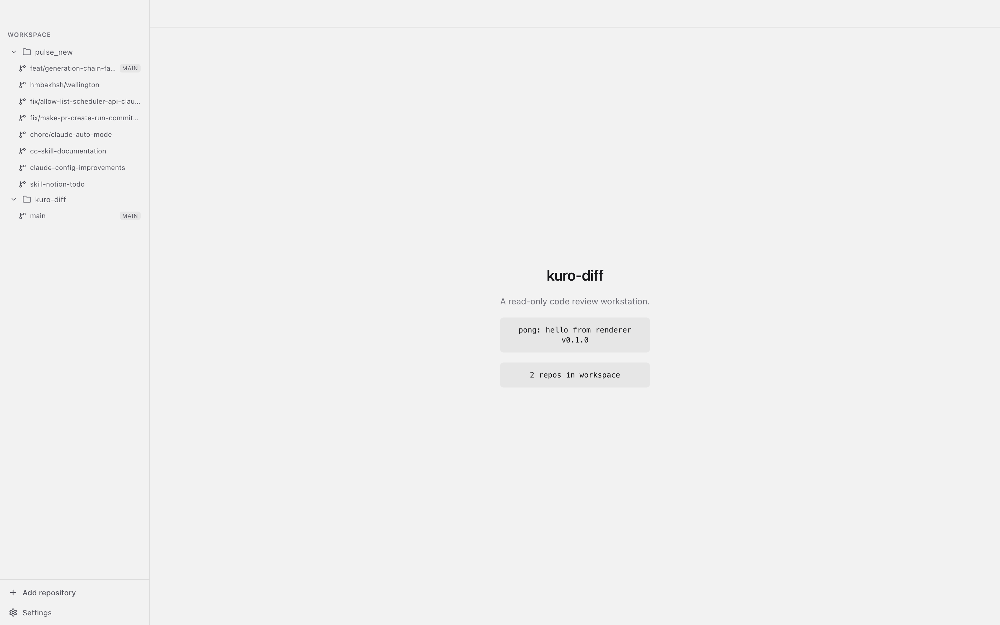
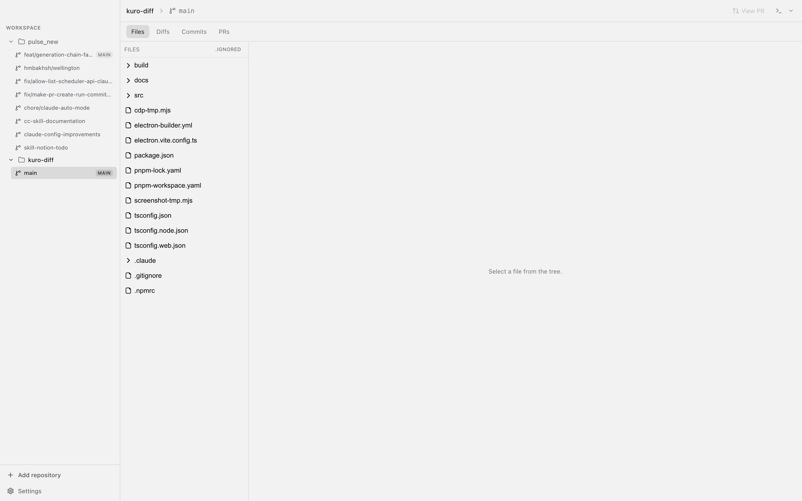
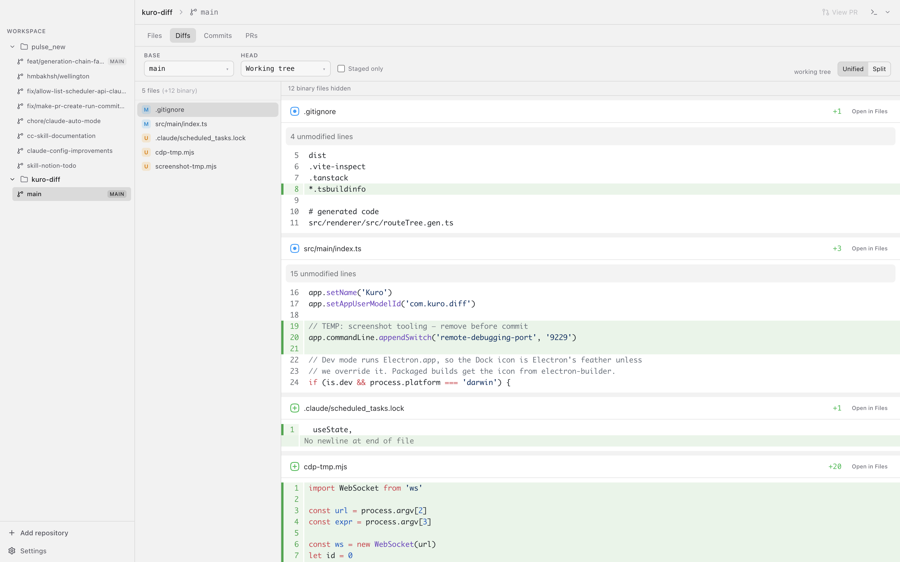
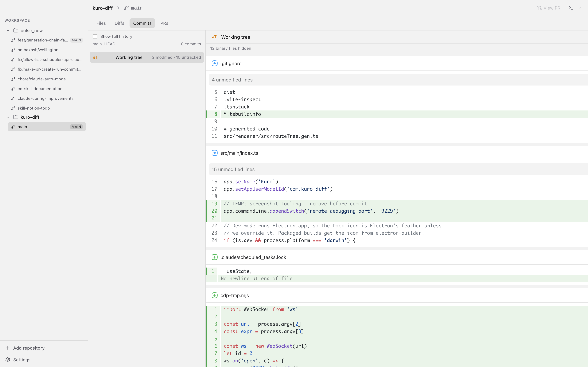
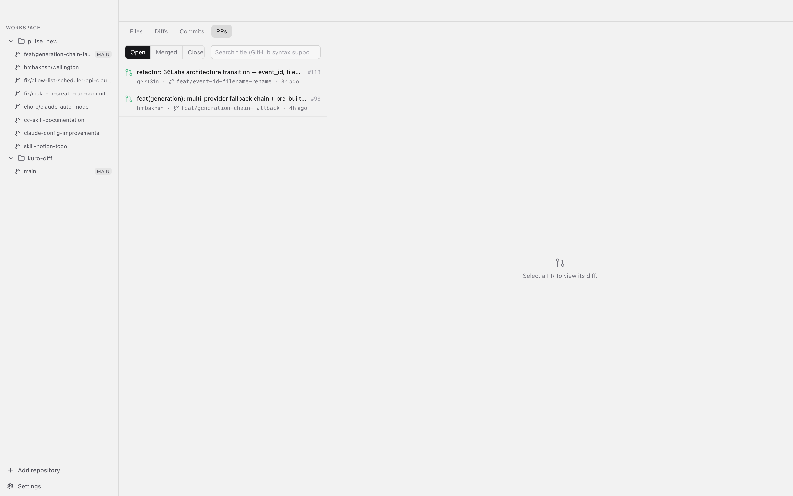
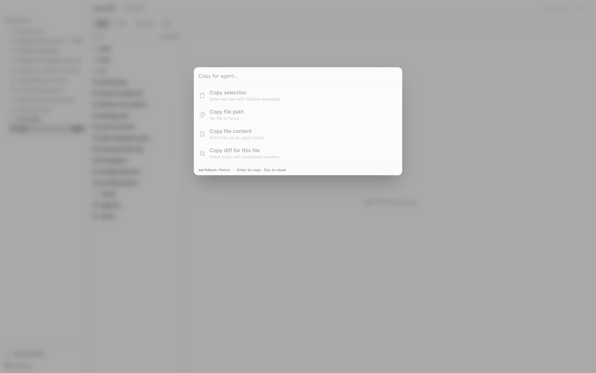
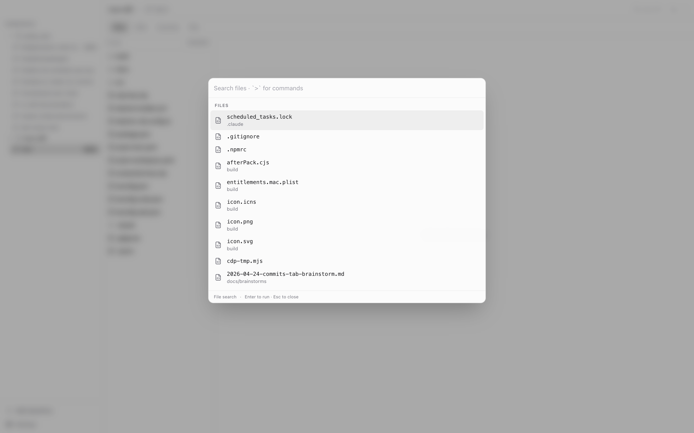
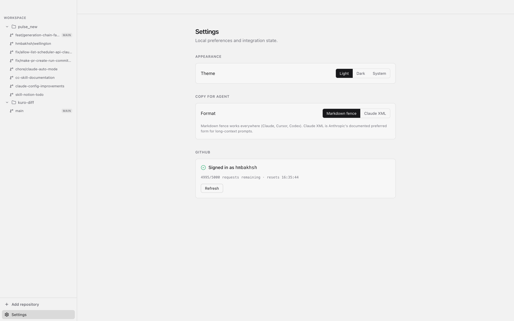

# Kuro

A macOS desktop workstation for reading code, reviewing diffs, and handing the right context to your AI agents.

Kuro is **read-only by design** — it never writes to your git tree. It's the view layer over repos you're already iterating on with Claude, Cursor, Codex, or whatever else: flip through worktrees, inspect diffs against any base, browse GitHub PRs, and copy selections/files/patches in the format your agent prefers.



---

## Features

### Multi-repo workspace with worktrees

Drag-drop a folder onto the sidebar to register a repo. Each repo expands into its worktrees, with the primary checkout tagged `MAIN` and a dirty dot on worktrees with uncommitted changes.



- Repos persist in `electron-store`, so your workspace stays intact across launches.
- Worktrees are discovered via `git worktree list` and kept fresh via `chokidar` watchers.
- Per-worktree UI state: the open file, diff scroll position, selected commit, and tab persist independently for every worktree.

### Diff viewer



- Compare working tree / staged / any revision against any base — branches, tags, commits.
- Unified and split modes, powered by [`@pierre/diffs`](https://www.npmjs.com/package/@pierre/diffs) with Shiki syntax highlighting.
- Untracked files show up with a distinct `U` badge so you never lose new work.
- "Open in Files" jumps straight from a diff hunk to the full file.

### Commits



A commit list rendered against your working tree, with the live uncommitted diff pinned as the first row. Click any commit to see its patch inline without switching views.

### GitHub PR browser



Any repo with a GitHub remote gets a **PRs** tab that shells out to the `gh` CLI:

- Open / Merged / Closed filter with GitHub-flavored search.
- Click a PR to see its diff rendered with the same viewer you use for local changes.
- "View PR" button in the titlebar opens the PR for the current branch on github.com.
- Rate-limit pill surfaces when your `gh` quota dips below 1000.

### Copy for Agent



`⌘⇧C` opens a palette with four copy actions tuned for LLM prompts:

- **Copy selection** — selected text plus file path and line range
- **Copy file path** — relative path of the focused file
- **Copy file content** — the whole file as an agent-ready block
- **Copy diff for this file** — patch body with base/head headers

Formatting preset is configurable between `markdown-fence` (works in every assistant) and `claude-xml` (Anthropic's preferred long-context form).

### Command palette



`⌘P` opens a `cmdk`-powered palette. Fuzzy-search files, jump to recently opened files, or type `>` to switch into command mode (go to Files/Diffs/Commits/PRs/Settings, cycle themes, switch repos and worktrees).

### Settings



- **Appearance** — Light / Dark / System.
- **Copy for Agent** — pick the default format your assistant prefers.
- **GitHub** — `gh` install + auth status, remaining API quota, reset time. Broken links surface `brew install gh` and `gh auth login` hints inline.

### Other niceties

- **Open in Ghostty / Finder** — split-button in the titlebar; your last choice becomes the one-click default.
- **Native window chrome** — `hiddenInset` titlebar with drag strip, vibrancy sidebar, and traffic-light insets tuned for macOS.
- **Shell-aware git** — login-shell `PATH` is resolved at startup so `git`, `gh`, and Ghostty Just Work even when launched from the Dock.

---

## Install

### Prerequisites

- macOS 12+ (this is a macOS-first app — no Windows/Linux builds ship today).
- **Node 20+** and **pnpm** (`corepack enable` is the simplest route).
- **git** on your `PATH`.
- **`gh` CLI** (optional, required only for the PRs tab): `brew install gh && gh auth login`.

### From source

```bash
git clone https://github.com/hmbakhsh/kuro-diff.git
cd kuro-diff
pnpm install
pnpm dev              # run the app against vite dev server
```

### Packaging a macOS build

```bash
pnpm build:mac        # produces a signed .app under ./dist
pnpm build:unpack     # unpacked build for quick smoke-testing
```

---

## Keyboard shortcuts

| Shortcut | Action |
|---|---|
| `⌘P` | Command palette (files + recents + commands) |
| `⌘⇧C` | Copy for Agent palette |
| `⌘,` | Open Settings |
| `⌘+` / `⌘-` | Zoom in / out |
| `⌘0` | Reset zoom |
| `Esc` | Close any open palette |

Type `>` as the first character in the command palette to enter command mode.

---

## Architecture

A standard Electron 35 + electron-vite split:

```
src/
├── main/           Node side — git ops, fs watchers, gh shelling, window/menu/security
│   ├── services/   Long-lived: git-binary, watcher-registry, workspace-store
│   └── trpc/       Router + context; procedures are the only IPC surface
├── preload/        Exposes tRPC ipcLink to the renderer (sandbox + contextIsolation on)
├── renderer/       React 19 + TanStack Router (hash) + Query + Pierre diff components
│   └── src/
│       ├── components/   layout · workspace · copy · diffs · prs
│       ├── routes/       file-based via @tanstack/router-plugin
│       ├── hooks/        useKeyboardShortcuts, useWorkspaceState, …
│       └── styles/       globals.css (Tailwind v4, single entrypoint)
└── shared/         Zod-validated types shared across main/renderer
```

Key decisions:

- **tRPC over `trpc-electron`** gives end-to-end typed procedures without a separate IPC schema.
- **TanStack Query persists to `localStorage`** (`kuro-diff-query-cache-v1`, 14-day max age) so launches are instant; cached data shows immediately and revalidates in the background.
- **Hash router** avoids Electron's file:// routing friction.
- **Pierre components** (`@pierre/diffs`, `@pierre/file-tree`) do the heavy rendering with Shiki highlighting, driven by a shared `WorkerPoolContextProvider`.
- **Security hardening**: `sandbox: true`, `contextIsolation: true`, CSP via `onHeadersReceived`, webview creation blocked, navigation allowlist limited to `github.com` / `api.github.com` / `docs.github.com` / `cli.github.com`.
- **No git writes, ever** — the app spawns `git` as a reader only. Everything that would mutate state (branch switch, commit, push) happens in your actual shell.

---

## License

MIT © Haroon Bakhsh
